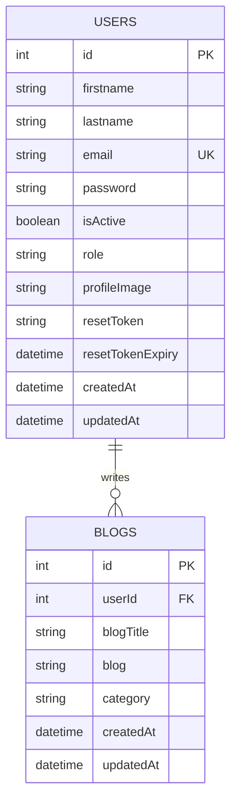
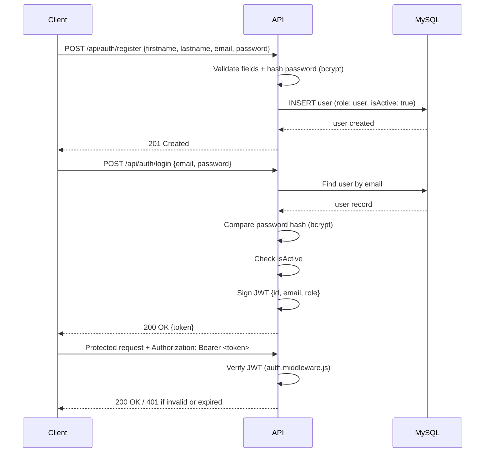
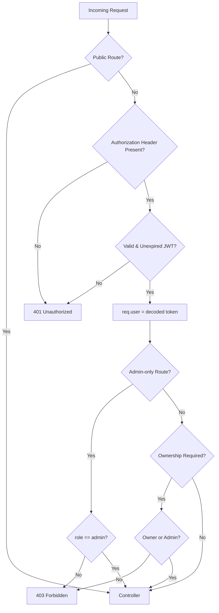

# BlogEra — Backend API

A **Role-Based Blog Management REST API** built with Node.js, Express, and MySQL (via Sequelize). It powers the [BlogEra frontend](../frontend) and supports three access levels — **Admin**, **User**, and **Guest** — with JWT-based authentication, password hashing, ownership-based blog authorization, and public blog search/filtering.

## Table of Contents

- [Tech Stack](#tech-stack)
- [Features](#features)
- [Project Structure](#project-structure)
- [Database Schema](#database-schema)
- [Getting Started](#getting-started)
- [Environment Variables](#environment-variables)
- [Promoting a User to Admin](#promoting-a-user-to-admin)
- [Authentication Flow](#authentication-flow)
- [Request Authorization Flow](#request-authorization-flow)
- [API Endpoints](#api-endpoints)
- [Role-Based Access Matrix](#role-based-access-matrix)
- [HTTP Status Codes](#http-status-codes)

## Tech Stack

| Category | Technology |
|---|---|
| Runtime | Node.js |
| Framework | Express 5 |
| Database | MySQL |
| ORM | Sequelize |
| Authentication | JSON Web Token (JWT) |
| Password Hashing | bcrypt |
| Environment Config | dotenv |
| File Uploads | multer |
| Email | nodemailer |
| CORS | cors |
| Dev Tooling | nodemon |
| API Testing | Postman |

## Features

- **Authentication** — Register/Login with hashed passwords and JWT-based sessions.
- **Password Recovery** — Forgot/reset password via a time-limited, emailed token (nodemailer).
- **Authorization** — Route-level (`authMiddleWare`) and role-level (`isAdmin`) middleware guarding protected endpoints.
- **User Management** — Admin can view, activate, and deactivate users; users can manage their own profile, password, and profile image.
- **Profile Image Upload** — `multipart/form-data` upload (multer), served statically from `/uploads`.
- **Blog Management** — Authenticated users can create, update, and delete their own blogs; admins can manage any user's blog.
- **Public Blog Discovery** — Guests can browse, search by title (partial match), and filter by category without authentication.
- **Validation** — Required-field checks, email format validation, minimum password length, numeric ID validation.
- **Security** — Passwords are hashed with bcrypt and are never returned in any API response. CORS restricted to the configured frontend origin.

## Project Structure

```
├── app.js                  # Express app setup, route mounting
├── server.js                # Entry point, DB connection & sync
├── config/
│   └── db.js                 # Sequelize connection config
├── models/
│   ├── users.model.js         # Users table schema
│   ├── blogs.model.js         # Blogs table schema
│   └── index.js                # Model associations (Users ↔ Blogs)
├── middlewares/
│   ├── auth.middleware.js     # JWT verification & admin role guard
│   └── upload.middleware.js   # multer config for profile image uploads
├── controller/
│   ├── auth.controller.js
│   ├── users.controller.js
│   └── blogs.controller.js
├── services/
│   ├── auth.services.js
│   ├── users.services.js
│   └── blogs.services.js
├── routes/
│   ├── auth.route.js
│   ├── users.route.js
│   └── blogs.route.js
├── utils/
│   ├── validateEmail.js
│   ├── validatePassword.js
│   ├── validateBlog.js
│   └── sendEmail.js           # nodemailer transporter for password-reset emails
├── uploads/
│   └── profile-images/        # uploaded avatars, served at /uploads/profile-images/*
└── collection/
    └── Blog App REST API Development.postman_collection.json
```

## Database Schema



| Table | Column | Description |
|---|---|---|
| **users** | `id` | Primary key |
| | `firstname` | User's first name |
| | `lastname` | User's last name |
| | `email` | Unique email address |
| | `password` | Hashed password (bcrypt) |
| | `isActive` | Defaults to `true`; blocks login when `false` |
| | `role` | Defaults to `user`; set to `admin` manually |
| | `profileImage` | Path to the uploaded avatar, e.g. `/uploads/profile-images/user-1-....jpg` |
| | `resetToken` / `resetTokenExpiry` | Hashed password-reset token and its 15-minute expiry |
| **blogs** | `id` | Primary key |
| | `userId` | Foreign key → `users.id` |
| | `blogTitle` | Blog title |
| | `blog` | Blog content |
| | `category` | Blog category |

## Getting Started

### Prerequisites

- Node.js (v18+ recommended)
- MySQL Server

### Installation

```bash
# 1. Clone the repository
git clone https://github.com/<your-username>/<your-repo>.git
cd "Blog App REST API Development"

# 2. Install dependencies
npm install

# 3. Create a MySQL database
CREATE DATABASE blogdb;

# 4. Set up environment variables (see below)
cp .env.example .env
# then fill in real values

# 5. Run the server
npm run dev     # development, with nodemon auto-restart
# or
npm start        # production
```

On startup, Sequelize automatically creates/syncs the `users` and `blogs` tables (with the foreign key relationship) in the configured database.

This API has no UI of its own — pair it with the [BlogEra frontend](../frontend) (Next.js + Tailwind) to use it as a real application, or exercise it directly via the Postman collection below.

## Environment Variables

Copy `.env.example` to `.env` and fill in real values. Never commit the real `.env`.

| Variable | Description | Example |
|---|---|---|
| `PORT` | Port the server listens on | `5000` |
| `DB_NAME` | MySQL database name | `blogdb` |
| `DB_USER` | MySQL username | `root` |
| `DB_PASSWORD` | MySQL password | `yourpassword` |
| `DB_HOST` | MySQL host | `localhost` |
| `DB_PORT` | MySQL port | `3306` |
| `SECRET_KEY` | Secret used to sign JWT tokens | `yourSecretKey` |
| `CLIENT_URL` | Frontend origin — used to build the password-reset link and as the allowed CORS origin | `http://localhost:3000` |
| `SMTP_HOST` | SMTP server for sending password-reset emails | `smtp.gmail.com` |
| `SMTP_PORT` | SMTP port | `587` |
| `SMTP_USER` | SMTP account username | `you@gmail.com` |
| `SMTP_PASS` | SMTP account password — for Gmail this must be an **App Password**, not your regular login password | `xxxx xxxx xxxx xxxx` |
| `SMTP_FROM` | "From" header on outgoing emails | `BlogEra <you@gmail.com>` |

## Promoting a User to Admin

There is no API endpoint to create an admin — this is intentional (a client can never self-assign the `admin` role). To create an admin account:

1. Register normally via `POST /auth/register`.
2. Manually update that user's role directly in the database:

```sql
UPDATE users SET role = 'admin' WHERE email = 'admin@example.com';
```

## Authentication Flow



## Request Authorization Flow



## API Endpoints

All routes are mounted under `/api` (e.g. `http://localhost:5000/api/blogs`).

### Auth

| Method | Endpoint | Access | Description |
|---|---|---|---|
| POST | `/api/auth/register` | Public | Register a new user |
| POST | `/api/auth/login` | Public | Login and receive a JWT |
| POST | `/api/auth/forgot-password` | Public | Email a password-reset link (always returns a generic success message, regardless of whether the email exists) |
| PATCH | `/api/auth/reset-password/:token` | Public | Set a new password using the emailed token |

### Users

| Method | Endpoint | Access | Description |
|---|---|---|---|
| GET | `/api/users` | Admin | Get all users |
| GET | `/api/users/:id` | Admin | Get a specific user by ID |
| PATCH | `/api/users/:id/status` | Admin | Activate/deactivate a user |
| GET | `/api/users/profile` | User, Admin | Get own profile |
| PUT | `/api/users/profile/update` | User, Admin | Update own firstname/lastname |
| PATCH | `/api/users/profile/image` | User, Admin | Upload/replace own profile image (`multipart/form-data`, field name `image`; JPEG/PNG/WEBP, max 2MB) |
| PATCH | `/api/users/password` | User, Admin | Update own password |

### Blogs

| Method | Endpoint | Access | Description |
|---|---|---|---|
| POST | `/api/blogs/create` | User, Admin | Create a blog |
| GET | `/api/blogs` | Public | List/search/filter blogs |
| GET | `/api/blogs/:id` | Public | Get a specific blog |
| PUT | `/api/blogs/update/:id` | User (own), Admin (any) | Update a blog |
| DELETE | `/api/blogs/delete/:id` | User (own), Admin (any) | Delete a blog |

**Search & Filter query params on `GET /api/blogs`:**

| Query Param | Behavior |
|---|---|
| `?title=` | Partial, case-insensitive match on `blogTitle` |
| `?category=` | Exact match on `category` |
| `?title=&category=` | Both filters applied together |

## Role-Based Access Matrix

| Action | Guest | User | Admin |
|---|:---:|:---:|:---:|
| Register | ✅ | ✅ | ✅ |
| Login | ✅ | ✅ | ✅ |
| View all blogs | ✅ | ✅ | ✅ |
| View blog by ID | ✅ | ✅ | ✅ |
| Search blog by title | ✅ | ✅ | ✅ |
| Filter blog by category | ✅ | ✅ | ✅ |
| Create blog | ❌ | ✅ | ✅ |
| Update own blog | ❌ | ✅ | ✅ |
| Update another user's blog | ❌ | ❌ | ✅ |
| Delete own blog | ❌ | ✅ | ✅ |
| Delete another user's blog | ❌ | ❌ | ✅ |
| Forgot/reset password | ✅ | ✅ | ✅ |
| View own profile | ❌ | ✅ | ✅ |
| Update own profile | ❌ | ✅ | ✅ |
| Upload own profile image | ❌ | ✅ | ✅ |
| Update own password | ❌ | ✅ | ✅ |
| View all users | ❌ | ❌ | ✅ |
| View user by ID | ❌ | ❌ | ✅ |
| Activate/deactivate users | ❌ | ❌ | ✅ |

## HTTP Status Codes

| Code | Meaning | Example |
|---|---|---|
| 200 | OK | Successful GET/PUT/PATCH/DELETE |
| 201 | Created | Successful registration or blog creation |
| 400 | Bad Request | Missing/invalid fields, invalid ID format |
| 401 | Unauthorized | Missing, invalid, or expired token |
| 403 | Forbidden | Authenticated but not allowed (role/ownership) |
| 404 | Not Found | User or blog does not exist |
| 409 | Conflict | Duplicate email on registration |
| 500 | Internal Server Error | Unexpected server-side failure |

